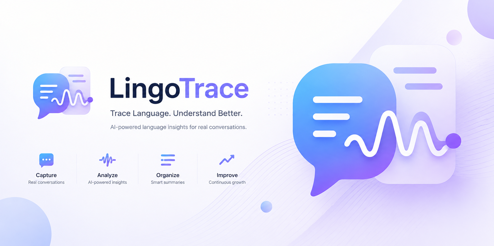
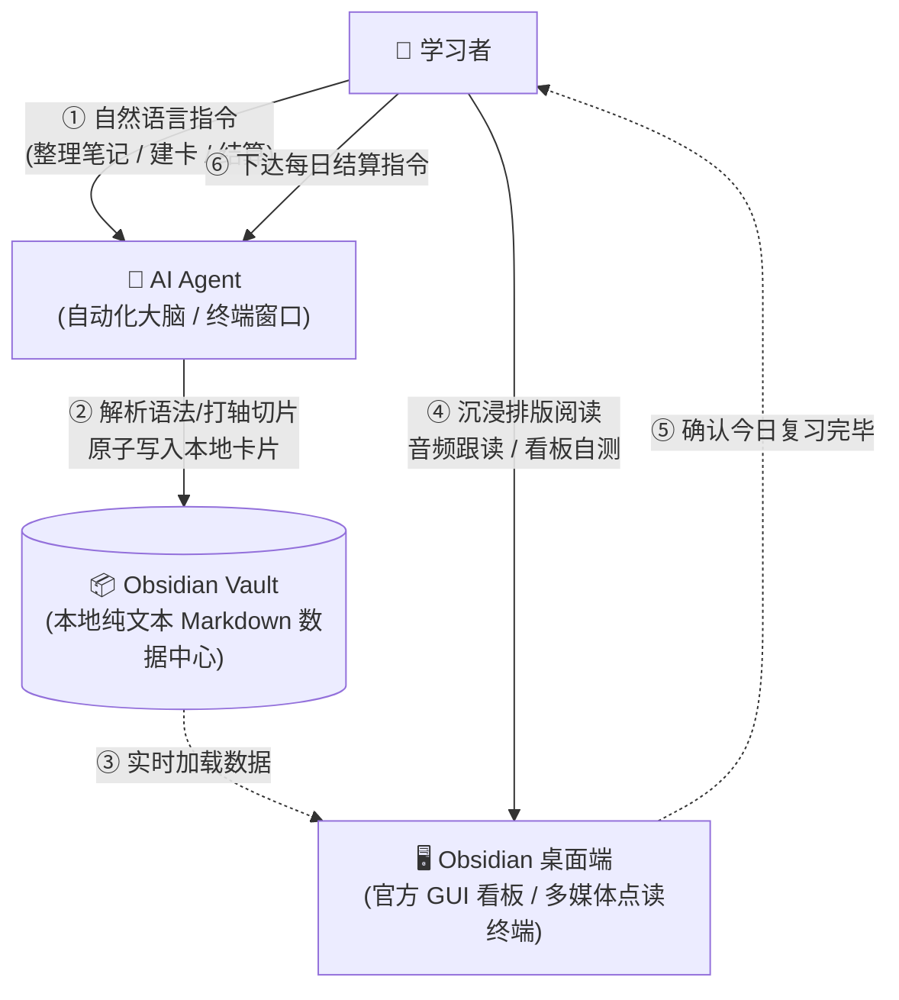
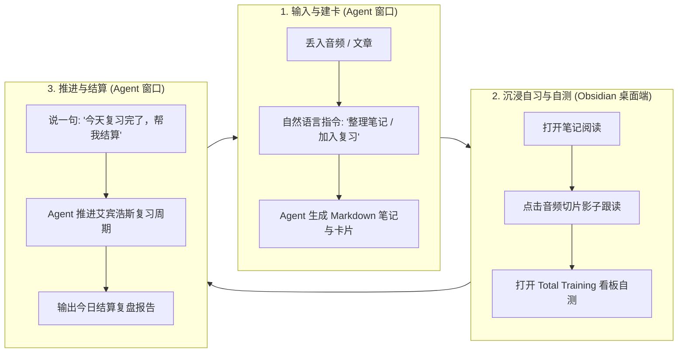

<p align="center">
  
</p>

<p align="center">
  
</p>

LingoTrace 是一个完全构建在 [Obsidian](https://obsidian.md) 之上的、高度定制化和自动化的**外语学习工作流引擎（当前完整支持日语与英语）**。

它剥离了底层的语音识别与音视频爬取技术（已交由子项目 [ListenKit](https://github.com/feiyanqiqiao/ListenKit) 负责），专注于解决一个核心痛点：**如何将泛听素材、外语播客和视频自动化转化为结构化的个人知识图谱，并将其内化为长时记忆和主动口语输出能力。**

本仓库开源 LingoTrace 公共核心、日语与英语语言包、初始化模板、迁移工具和公共验证测试。私人 Vault 中的真实学习资料、音频、每日记录和运行产物不属于本仓库。

# 架构分工与日常闭环

为了兼顾“数据完全本地自主”与“极简智能化操作”，LingoTrace 采用 **三位一体** 的协作架构：



- **🧠 AI Agent（大脑与自动化执行器）**：负责听力转写、长文语法解析、自动提炼词汇/口语卡、计算艾宾浩斯记忆周期与每日复习结算。你只需要用自然语言给它下达指令。
- **📦 Obsidian Vault（本地数据中心）**：所有学习笔记、复习卡片、音频文件均以纯文本 Markdown 和标准 Frontmatter 保存在你本地的 Vault 文件夹中，数据资产 100% 归你所有。
- **🖥️ [Obsidian 桌面端](https://obsidian.md)（官方 GUI 看板与多媒体终端）**：作为系统的图形用户界面（GUI），提供精美的双链排版阅读、音频切片点读跟读，以及基于 `.base` 数据库文件的 `Total Training Dashboard`（全景训练看板）。

## 极简日常学习闭环

你的日常学习动线非常清晰，无需在不同工具间迷失：



1. **输入与建卡（在 Agent）**：把文章或音频丢给 AI 助理，说“做成精听稿”或“把生词加入复习”；
2. **阅读与自测（在 Obsidian）**：打开 Obsidian 桌面端阅读排版好的笔记，点击切片跟读，在看板中自测今日待复习卡片；
3. **推进与结算（在 Agent）**：自测完成后对 AI 助理说一句“今天复习完了，帮我结算”，系统自动推进记忆阶段。

# 一句话开始

如果你只想使用 LingoTrace 学习，不准备改代码，把下面整句话发给能操作本机文件和命令的 AI Agent：

> 请阅读并严格执行 https://raw.githubusercontent.com/feiyanqiqiao/LingoTrace/main/docs/learner-agent-setup.md ，帮我安装 LingoTrace 并初始化第一个学习 Vault。

Agent 会询问语种与存放位置，检测 Python、Git、Obsidian 桌面客户端和 ListenKit；任何安装或下载都先征得你的同意。要用好 LingoTrace，必须安装 [Obsidian 桌面端](https://obsidian.md/download) 作为官方图形交互界面，以获得完整的排版阅读、全景看板和音频切片点读体验；ListenKit 负责音视频导入与转写，可按需选装。详细的人类版说明见 [学习者入门](docs/getting-started.md)。

如果你想 fork 并增加语种或功能，把 [开发者初始化协议](docs/developer-agent-setup.md)交给 Agent。它会带你完成 GitHub 账号与 `gh` 检查、fork、remotes、topic branch、测试、推送、上游 PR 和 CI 检查；开发者的实际学习 Vault 仍复用上面的学习者流程。

# 🚀 日常入口与核心工作流

LingoTrace 的主要使用方式是：用户用自然语言提出学习任务，由 Codex 或兼容的 AI agent 读取当前 Vault 所选语言包的 Agent Skill，并把任务保存到对应的日语或英语学习库。

日常学习时，应把私人 Vault 作为 Agent 工作区；LingoTrace 公共仓库作为 Vault 外部运行时。初始化器会生成 Vault 根 `AGENTS.md` 和当前操作系统的运行时连接，使 Agent 能从 Vault 工作区发现语言包。Windows、macOS 和 Linux 分别保存连接，不会相互覆盖。

ListenKit 的程序位置也按 Windows、macOS 和 Linux 分别保存在 Vault 中。需要音视频能力时，Agent 先解析已确认的位置；路径失效时会让用户选择重新安装或指定已有目录，不会猜测，也不会阻止无关的文字学习。

每天第一次开始学习时，Agent 会顺手检查一次正式上游有没有更新。有更新时，它会用中文概括一至三点并问你是否现在更新；你可以不理会，继续当天学习。正式上游运行时只有在你明确同意后才安全快进；如果连接的是你自己的 fork，Agent 不会代替你 pull 或合并，只会提醒你到开发仓库自行同步。

你可以直接这样说：

- “请把这段音频做成精听稿。”
- “帮我把这篇材料整理成英语学习笔记。”
- “把这个词加入复习。”
- “这句话很实用，帮我做成口语卡。”
- “今天复习结束了，帮我结算。”

Agent Skill 会把这些自然语言请求映射到听力笔记、来源笔记、复习材料、生活口语卡和每日复习结算五个能力。底层仍由 LingoTrace core 和当前选中的 Japanese 或 English language pack 负责安全检查、路径边界和保存行为；普通用户不需要记内部函数名或命令。

这些句子只是示例，不是固定提示词。Agent Skill 会先识别真实学习意图，再选择对应能力；“更新总训练表”和“请更新总训练表”是明确的每日复习结算请求。只有“处理一下总训练表”“总训练表有点问题”这类未说明是结算还是视图维护的表达，才会先确认你的意思。

新增听力笔记、来源笔记和口语卡时，系统会避免覆盖你已经手工整理过的笔记。复习材料合并、移动、覆盖或非结算状态修改会先让我确认；明确的每日复习结算请求会先内部预览，确认无错误后直接保存并报告结果。

# 两个目录、两个工作区角色

普通使用者的推荐结构是：

```text
LingoTrace runtime/       # 正式程序与语言包，用于更新
LingoTrace-English/       # 私人 Obsidian Vault，用于每天学习
```

日常学习时在 Codex 中打开私人 Vault；修改程序时才打开完整的开发仓库。初始化器会把两者连接起来。换设备后，如果本机路径变化，Agent 会询问并追加当前平台路径，不覆盖其他系统记录。

普通用户的最小 Git checkout 只包含 `lingotrace/` 运行时，不包含测试、开发工具和贡献文档；开发者使用完整 checkout。技术边界见 [安装与双用户旅程设计](docs/installation-and-onboarding-design.md)和 [Vault 初始化与跨平台运行时连接](docs/vault-initialization-and-runtime-connections.md)。

每日检查按设备和操作系统分别记录，同一天不会反复联网或反复询问。检查失败、网络不可用、忽略更新或 fork 提示都不会阻止原来的学习任务。详见 [每日首次学习的运行时更新设计](docs/daily-runtime-update-design.md)。

# 📚 当前文档

为了更好地了解本系统的产品哲学、架构约束与适用人群，请参阅 `docs/` 目录下的详细分析报告：

- 🗂️ **[文档索引](docs/README.md)**：当前文档入口与文档生命周期规则。
- 🧑‍🎓 **[学习者 Agent 安装协议](docs/learner-agent-setup.md)**：从 GitHub Raw 读取的一句话安装入口。
- 🧑‍💻 **[开发者 Agent 初始化协议](docs/developer-agent-setup.md)**：fork、分支、上游同步、PR 与 CI 的逐步流程。
- 🔄 **[每日首次学习的运行时更新设计](docs/daily-runtime-update-design.md)**：每天一次检查、人话摘要、忽略选项与 fork 安全边界。
- 🎧 **[ListenKit 安装位置与跨平台连接](docs/listenkit-installation-and-connections.md)**：默认建议、自选目录、按平台保存和失联恢复。
- 🏗️ **[产品与能力说明](docs/lingotrace_product_document.md)**：说明当前产品定位、学习闭环、能力和数据边界。
- 👥 **[早期用户画像与准入门槛](docs/lingotrace_user_persona.md)**：目标受众分析、不适合人群说明，以及面向早期极客测试者的“一分钟自查问卷”。
- 🌐 **[多语言架构](docs/lingotrace_multilingual_architecture_plan.md)**：当前正式架构来源，定义单语言 Vault、外部运行时、语言包和跨平台连接。
- 🧩 **[新语言包贡献指南](docs/multilingual/language-pack-contributor-guide.md)**：项目组成员和其他 Agent 开发 Korean、German 等后续语言包时的接入边界、目录结构、禁止项和验收规则。不要直接复制 Japanese pack 的语言学规则。
- 🤖 **[新语言包 Agent 交接模板](docs/multilingual/language-pack-agent-handoff-template.md)**：把新语言包任务交给 Codex、Claude Code、Trae 等 Agent 时可直接复用的任务说明模板。

# 🤝 参与贡献与开源许可

本项目采用 **AGPL v3** 协议开源，鼓励极客自由分发、学习与修改。为了防范未经授权的直接商业化套壳行为，并保障早期参与者的权益，我们制定了严格的开源商业化规则：

- **贡献指南与条款**：参与项目前请务必仔细参阅 [CONTRIBUTING.md](CONTRIBUTING.md)。
- **CLA (贡献者许可协议)**：向本项目提交有效代码（Merge PR）即代表您不可撤销地授权核心维护团队在未来的任意场景（含闭源商业化变现产品）中免费使用。
- **名誉回馈机制**：我们为社区贡献者建立了三级回馈门槛。针对提供有效代码合并的核心贡献者，除了在商业版的“致谢墙”专属展示外，未来还将获赠商业化客户端的终身免费授权（VIP）。

# 📂 仓库结构

- `lingotrace/`：公共核心、日语与英语语言包、Vault 初始化和迁移支持代码。
- `tests/lingotrace/`：核心、语言包、初始化和迁移行为测试。
- `tools/git/`：公共仓库安全检查，防止私人 Vault 文件进入提交。
- `tools/architecture-baseline/`：架构契约与当前行为基线测试。
- `tools/listening-transcribe-official/`：听力链相关的公共工具和测试。
- `docs/`：当前产品、架构、使用和语言包契约文档。

# ⚠️ 隐私、版权与使用声明

本仓库**仅开源系统的自动化框架、理念设计和执行脚本**，绝不包含个人金库内的实际笔记。在使用本系统构建你自己的学习库时，请务必遵守以下原则：

- **请勿提交** 任何属于你个人的 Obsidian 私人日记或打卡记录。
- **请勿提交** 任何受版权保护的商业教材音频、视频及配套的转写原始文件。
- **请勿提交** `.obsidian/` 本地工作区配置文件或工具生成的临时音频切片文件。

通用音频导入与外部语音识别，请配合部署本系统的前置依赖项目：[ListenKit](https://github.com/feiyanqiqiao/ListenKit)。

听力链使用两个隔离的 Python 3.14 虚拟环境，部署与故障排查见 [Listening Runtime Isolation](docs/listening-runtime-isolation.md)。
