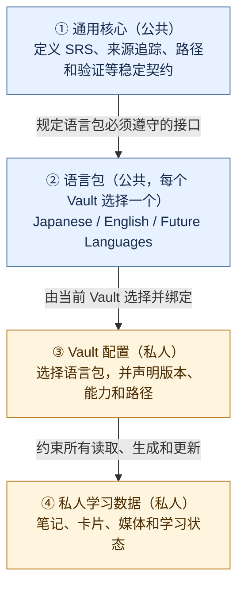
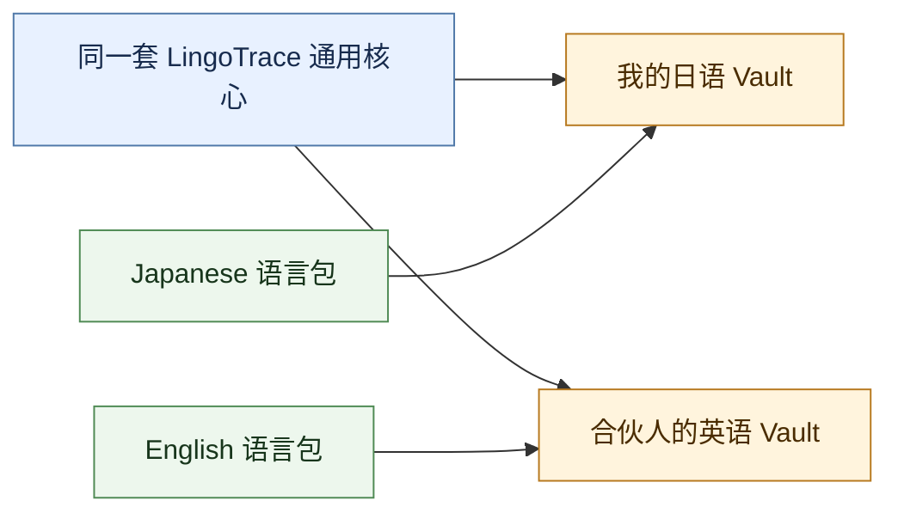

# LingoTrace 多语言架构总体规划方案

## 1. 文档定位

本文是 LingoTrace 多语言演进的正式总体规划，用于统一产品边界、目标架构、阶段路线、协作治理和验收门槛。

本文不直接安排代码实施，不包含文件级改造清单、脚本修改步骤、英语卡片的完整字段设计、任务排期或工作量估算。后续各阶段开始前，应在本文约束下另行编写阶段设计和实施计划。

相关资料：

- [产品需求与架构白皮书](lingotrace_product_document.md)：记录当前以日语为主的产品能力和数据模型。
- [功能模块与用户旅程审计报告](lingotrace_audit_report.md)：记录当前五个工作流和学习闭环。
- [多语种与多 Agent 终端演进方案](lingotrace_multilingual_multiagent_design.md)：保留为早期研究材料，本文取代其中的多语言总体架构决策。
- [用户操作指南](USER_GUIDE.md)：记录当前公开版本的实际使用方式和安全边界。

文档解释顺序如下：

1. 本文定义多语言演进的目标边界和架构决策。
2. 各阶段专项设计定义该阶段的新接口和迁移方案。
3. 当前 `SKILL.md`、模板和脚本定义迁移前的实际运行行为，只作为迁移来源和验收基线，不构成新框架的长期接口。
4. 产品白皮书、审计报告和早期研究用于解释背景，不覆盖本文已经确认的架构决策。

当目标架构与当前实现不同，应明确标注为“尚未实现”，不能把规划描述当作当前能力；当专项设计需要改变本文决策，应先评审并更新本文。

> [!important] 约束
> 本规划采用“一个公共项目支持多种目标语言，一个私人 Vault 只启用一种目标语言”的模式。当前不规划在同一个 Vault 中混合管理多种目标语言。

## 2. 背景与问题

### 2.1 项目来源

LingoTrace 最初从个人日语学习知识库逐步演化而来。现有目录、模板、字段、Skills、词典和听力处理规则都经过真实日语学习场景验证，形成了从输入、整理、复习到输出的完整闭环。

项目公开后，其目标发生了变化：LingoTrace 不再只服务一个人的日语学习，而需要成为可被其他学习者采用、扩展和贡献的外语学习工作流项目。英语将成为第一个新增目标语言，未来可能继续扩展到韩语、德语等语言。

### 2.2 当前实现的特点

当前版本已经具备若干可跨语言复用的能力：

- 基于 Obsidian Markdown、Frontmatter、Wikilink 和 Bases 的学习资料管理方式。
- 从原始材料到来源笔记、复习卡、定期复习和主动输出的学习闭环。
- Focus 重点复习层和 Base 基础词库层组成的双层词汇生命周期。
- 确定性的 SRS 阶段推进、延期处理和每日结算。
- 素材来源、转写产物、音频和学习卡之间的追踪关系。
- 大模型负责语义判断、脚本负责确定性状态管理的人机分工。
- 公开仓库与私人学习资料隔离的安全边界。

但这些通用能力目前与日语实现深度交织，例如：

- Skills 使用 `jp-*` 命名，并在规则中直接描述日语学习行为。
- 标签使用 `jp/` 命名空间。
- 词汇字段包含 `reading`、`accent_display` 和 `kanji_diff_pairs`。
- 听力处理默认使用 `Japanese` 或 `ja-JP`。
- 离线语言资源依赖日语分词、假名和音调数据。
- 总训练面板和验证脚本直接读取日语专属字段。

### 2.3 核心风险

如果英语学习在缺少总体架构的情况下直接迭代，容易出现以下问题：

1. 把日语专属字段机械改名为看似通用的字段，既破坏日语学习语义，又无法真实表达英语需求。
2. 为了快速支持英语而复制整套日语逻辑，形成两套逐渐分叉的系统。
3. 把尚未经过验证的英语需求写入公共核心，使核心成为日语与英语规则的混合体。
4. 在核心重构、日语迁移和英语功能开发同时进行时扩大变更范围，导致问题无法定位。
5. 多个用户的真实学习反馈直接推动底层接口变化，使项目演进失去稳定边界。

因此，多语言扩展必须先建立明确的产品边界和架构契约，再允许各语言能力逐步落地。

## 3. 已确认的产品决策

### 3.1 单目标语言 Vault

LingoTrace 作为一个公共项目支持多个目标语言，但每个私人 Vault 在创建时只选择一种目标语言。

```text
LingoTrace 公共项目
├── Japanese 语言包
├── English 语言包
└── 未来语言包

个人日语 Vault   -> Japanese 语言包
个人英语 Vault   -> English 语言包
个人德语 Vault   -> German 语言包
```

同一个人学习多种语言时，分别建立多个 Vault。不同语言的词汇、语法、发音、听力资料、复习队列和个人记录不在同一个 Vault 中混合。

这一决策带来以下约束：

- 普通卡片不必重复保存目标语言标识，目标语言由 Vault 配置确定。
- 查重、路径、模板、面板和词典均在单一目标语言范围内工作。
- 各语言可以拥有最适合自身的目录、字段和学习规则。
- 公共核心不负责跨语言检索、跨语言复习面板或跨语言统计。

### 3.2 目标语言与解释语言分离

项目需要区分：

- **目标语言**：学习者正在学习的语言，例如日语或英语。
- **解释语言**：模板说明、词义解释和 Agent 输出所使用的语言，例如简体中文。

第一阶段以中文学习者为主要用户，因此 Japanese 和 English 语言包默认使用简体中文解释。架构上保留解释语言概念，但当前不要求一个语言包立即提供多种解释语言版本。

解释内容不属于 SRS 公共核心。迁移后的 Japanese 卡片继续使用 `meaning_zh` 等 Japanese 语言包字段；English 包可以在专项设计中定义自己的中文解释字段。公共核心不得读取字段名称来推断解释语言，也不强制把现有字段迁移成通用 `meaning`。

### 3.3 公共引擎与私人 Vault 分离

长期目标不是在每个 Vault 中复制一套独立项目代码，而是由公共 LingoTrace 项目维护通用核心和语言包；私人 Vault 保存自身配置、模板实例和私人学习数据。

目标部署采用以下边界：

- LingoTrace 公共仓库是核心、第一方语言包和发布工具的源代码来源。
- 发布或安装后的运行时位于私人 Vault 之外，由多个单语言 Vault 复用。
- 私人 Vault 只保存 Vault 配置、路径配置、模板实例和私人学习数据。
- “公开仓库位于日语 Vault 内”的旧部署方式仅作为迁移来源存在，不作为支持模式保留。
- 语言包升级不得通过复制并覆盖整个私人 Vault 完成。

私人 Vault 中的以下内容不进入公共仓库：

- 个人学习笔记、课堂记录和复盘。
- 词汇、语法、错题和口语卡的真实数据。
- 音频、视频、图片、PDF 和转写产物。
- Obsidian 本地工作区状态和临时文件。

### 3.4 Japanese 完整迁移与旧框架退出

现有日语系统是新框架的首个迁移对象，而不是需要长期并行维护的旧版本。迁移终态只有一套公共核心、一套 Japanese 语言包和一个运行在新框架下的日语 Vault。

- 新建符合目标架构的日语 Vault，不在旧 Vault 内原地改造框架。
- 先安装新核心、Japanese 语言包、Vault 配置和新模板，再迁移私人学习资料。
- 学习笔记、卡片、媒体、来源产物、复习状态和人工内容按原相对路径整体迁移，除非新框架存在明确且经过评审的强制结构要求。
- `reading`、`accent_display`、`kanji_diff`、`kanji_diff_pairs`、`meaning_zh` 等日语字段保留，并登记为 Japanese 语言包正式 Schema，不作为待淘汰旧字段。
- `jp/` 标签和现有学习资料目录只要仍适合 Japanese 包，可以继续作为语言包数据约定；不得为了框架统一进行无价值重写。
- 旧 `codex-skills` 布局、`jp-*` 旧入口、旧配置发现方式、Vault 内嵌公共仓库和其他耦合实现不进入最终架构。
- 迁移期允许使用临时转接器、复制工具和验证工具，但它们必须有明确退出条件，不能成为长期兼容层。
- 新日语 Vault 完成五个工作流、数据完整性和人工内容验收后，旧 Vault 进入只读封存；经用户最终确认后删除，旧框架同时从公共仓库退出。
- 新框架发布后不提供旧框架运行模式，也不接受依赖旧入口的新功能。

## 4. 目标架构

### 4.1 四层结构

四层结构按“公共项目提供能力，私人 Vault 选择并使用能力”的顺序理解：



图中的箭头表示“下一层必须遵守上一层的约束”，不是学习数据在各层之间移动。前两层由 LingoTrace 公共项目维护，后两层属于用户自己的 Vault。

| 层级 | 回答的问题 | 典型内容 | 所有者 |
|---|---|---|---|
| ① 通用核心 | 所有语言共同遵守什么规则？ | SRS、来源追踪、路径边界、版本和验证 | LingoTrace |
| ② 语言包 | 这门语言具体怎样学习？ | 模板、Skills、词典、发音和语言专属字段 | LingoTrace 语言包维护者 |
| ③ Vault 配置 | 这个 Vault 选择什么能力？ | 目标语言、解释语言、语言包版本、能力和路径 | Vault 用户 |
| ④ 私人学习数据 | 用户实际学习了什么？ | 笔记、卡片、音频、复习状态和个人批注 | Vault 用户 |

同一个公共核心可以服务多个独立 Vault，但每个 Vault 只绑定一个语言包：



因此，四层分别承担以下职责：

1. **通用核心**：提供不依赖具体目标语言的稳定能力。
2. **语言包**：实现某一种目标语言的模板、规则和资源。
3. **Vault 配置**：选择语言包、解释语言、Schema 版本和启用能力。
4. **私人学习数据**：保存用户自己的笔记、卡片、媒体和学习状态。

### 4.2 运行与分发边界

通用核心和语言包组成 Vault 外共享运行时。运行时通过显式 Vault 配置进入某个 Vault 的上下文，不持有私人学习内容，也不能扫描未在配置中声明的其他 Vault。

运行与分发遵守以下原则：

- 公共仓库中的源码是维护来源；安装产物和 Vault 内模板实例不是反向修改源码的依据。
- 同一运行时可以服务多个 Vault，但一次操作只能绑定一个 Vault 根目录和一个语言包。
- 运行时不得把一个 Vault 的配置、缓存、查重结果或学习状态带入另一个 Vault。
- Vault 内生成的模板实例允许用户定制；升级时必须区分“语言包默认模板”和“用户已修改模板”。
- 阶段 0 至阶段 4 只支持随 LingoTrace 发布的第一方语言包。外部语言包安装、签名和信任机制在形成独立安全设计前不开放。

### 4.3 通用核心职责

通用核心只处理已经明确具有跨语言意义的能力：

- SRS 阶段、日期计算、延期规则和每日复习结算。
- Focus/Base 双层词汇生命周期的公共状态流转。
- 来源材料、来源笔记和复习卡之间的追踪约定。
- Vault 路径角色和配置读取机制。
- 公共卡片状态字段及其合法性验证。
- 语言包发现、能力查询和版本兼容检查。
- 只读预检、写入前验证和升级框架。
- 公开文件允许列表和私人数据保护。
- 五个产品工作流的公共输入、输出和失败契约。

通用核心不得包含：

- 某种语言的发音体系、文字体系或语法分类。
- 某种语言专属的词典、分词器或音调数据。
- 针对日语或英语写死的字段、标签和路径。
- 只经过一种语言验证的内容生成规则。

### 4.4 语言包职责

每个语言包负责该目标语言的学习语义和资源，包括：

- 目标语言标识、默认 locale 和转写参数。
- 已实现工作流及其成熟度。
- 词汇、语法、发音、听力和口语卡模板。
- 语言专属字段及其校验规则。
- 词典、分词、音标、音调或其他语言资源。
- 文本断句、标准化和转写后处理规则。
- 例句、搭配、自然度、礼貌程度和表达选择规则。
- 语言专属 Skills 入口和 Agent 指令。
- 面向该语言的 Obsidian Bases 展示字段。

Japanese 语言包可以保留：

```text
reading
accent_display
kanji_diff
kanji_diff_pairs
```

English 语言包可以使用：

```text
ipa
part_of_speech
word_stress
inflections
```

这些示例用于说明语言扩展边界，不构成英语模板的最终字段清单。项目不建立容纳所有语言学特征的万能 Schema。

### 4.5 Vault 配置职责

Vault 配置必须显式声明该 Vault 的运行上下文，逻辑结构如下：

```yaml
vault_schema_version: 1
target_language: ja
explanation_language: zh-CN
language_pack: japanese
language_pack_version: 1.0.0
enabled_capabilities:
  - source_notes
  - review_materials
  - review_rollover
```

Vault 配置与路径角色配置属于不同关注点：

- Vault 配置回答“这是哪一种语言的学习库、使用哪个语言包、开放哪些能力”。
- 路径配置回答“各类学习资料在当前 Vault 中存放在哪里”。

配置规则如下：

- `target_language` 和 `explanation_language` 使用 BCP 47 兼容的语言标识。
- `language_pack` 使用不会随显示名称变化的稳定标识。
- `language_pack_version` 固定当前 Vault 已验证的语言包版本；升级必须显式执行并重新验证。
- `enabled_capabilities` 只能选择语言包清单中已声明且依赖完整的能力。
- 路径解析优先使用 Vault 的显式路径配置，其次使用语言包默认路径；新框架不提供基于旧目录锚点的隐式 Vault 或语言识别。
- Vault 配置中的语言身份优先于路径和标签，路径配置不得覆盖目标语言或语言包选择。

新建 Vault 必须显式选择语言包，不能依靠文件夹名称、现有卡片内容或转写文本猜测目标语言。

### 4.6 私人数据职责

私人 Vault 保留用户对学习材料的最终控制权。语言包和核心更新不得无条件重写：

- 人工挑选的常用句。
- 手工确认的发音、音调和词义。
- 学习复盘和错题原因。
- 卡片中的个人备注和 Wikilink。
- 用户保存的音频引用和来源关系。

任何需要改写私人学习内容的迁移都必须提供预览、明确范围和独立确认。

## 5. 五个工作流的分层契约

五个现有工作流继续作为 LingoTrace 的产品级能力。语言包可以逐步实现这些能力，但实现后必须遵守对应的公共契约。

### 5.1 固定听力笔记生成

当前日语实现：[JP Listening Script Generator](../codex-skills/jp-listening-script-generator/SKILL.md)

公共核心负责：

- 接收本地媒体或 URL 作为输入。
- 管理 ListenKit 转写产物和来源记录。
- 管理泛听、精听及音频切片的通用生命周期。
- 验证引用的音频、转写和切片真实存在。
- 定义完整、失败和待人工确认等状态。

语言包负责：

- 转写语言和 locale。
- 断句、对话识别和文本标准化。
- 发音、音调或音标标注。
- 语言专属的转写纠错边界。
- 可背句的自然度、复用性和表达价值判断规则。

### 5.2 灵活来源笔记生成

当前日语实现：[JP Source Note Generator](../codex-skills/jp-source-note-generator/SKILL.md)

公共核心负责：

- 建立可追踪的素材包。
- 保存原始来源、最终媒体、转写 Markdown 和结构化产物的关系。
- 要求正文之后保留转写附录。
- 保持来源笔记与后续复习卡之间的可追踪性。

语言包负责：

- 判断材料中的词汇、语法、表达、写作或发音价值。
- 使用适合目标语言的知识组织方式。
- 生成目标语言例句和解释语言说明。
- 识别语言专属的学习难点。

### 5.3 复习材料维护

当前日语实现：[JP Review Material Maintainer](../codex-skills/jp-review-material-maintainer/SKILL.md)

公共核心负责：

- Focus 层优先、Base 层其次的查重和路由契约。
- 卡片创建、更新、重新激活和下沉的生命周期。
- 公共复习状态和来源字段。
- 防止批量写入造成重复或状态损坏。
- 使用语言包返回的规范身份执行查重，不直接比较未经规范化的词头文本。

语言包负责：

- 词汇、语法、错题和发音卡的具体模板。
- 词头规范化和语言专属查重规则。
- 词义、搭配、例句、语法接续和易混项规则。
- 发音字段、文字变体和语言特征校验。

### 5.4 生活口语卡维护

当前日语实现：[JP Survival Speaking Card Generator](../codex-skills/jp-survival-speaking-card-generator/SKILL.md)

公共核心负责：

- 场景、功能、说话角色、来源和复习状态。
- 口语卡与原始材料或音频切片之间的引用。
- 防重、场景归档和卡片生命周期。
- 只允许人工确认后的材料进入正式口语卡库。

语言包负责：

- 判断目标语言表达是否自然、可直接使用。
- 处理礼貌体系、语域、固定回应和文化适用边界。
- 提供目标语言句子、变体和回复提示。

### 5.5 每日复习结算

当前日语实现：[JP Next-Day Review Updater](../codex-skills/jp-next-day-review-updater/SKILL.md)

公共核心负责：

- 推进 `review_stage`。
- 计算 `next_review` 和延期容差。
- 重置 `done_today` 并更新 `last_reviewed`。
- 生成每日完成摘要。
- 在词汇完成周期时触发 Focus 到 Base 的下沉。

语言包负责：

- 声明词汇下沉时需要保留的专属字段。
- 提供 Base 词汇卡的语言专属渲染方式。
- 验证下沉后的卡片仍符合该语言包的 Schema。

每日复习结算是最接近纯通用核心的工作流，但它不能假设所有语言都使用日语词汇字段。

## 6. 公共数据与能力契约

### 6.1 公共复习卡外壳

参与 SRS 的学习对象共享以下公共状态概念：

```text
track
item_type
status
priority
done_today
review_stage
next_review
last_reviewed
first_seen
last_seen
seen_count
error_count
source_notes
```

公共核心只能依据公共外壳推进状态。它读取或重写卡片时，必须原样保留不认识的语言专属字段和人工维护正文。

字段所有权必须明确：

- 上述公共字段属于核心保留字段，语言包可以提供显示名称和模板默认值，但不能改变字段语义。
- `track` 使用当前核心训练线 `class_review`、`survival_speaking`、`listening`、`pronunciation`；语言包可以启用其中一部分，新增训练线需要核心架构评审。
- `item_type` 允许语言包扩展，但必须在语言包清单中声明。
- 语言专属字段继续采用便于 Obsidian Bases 使用的扁平 Frontmatter，但必须在语言包清单中声明，且不得与核心保留字段重名。
- 现有 Japanese 扁平字段迁移后成为 Japanese 语言包正式字段，不为追求形式统一而迁移到通用容器。
- 标签由语言包和 Vault 模板管理，核心不得依赖 `jp/`、`en/` 等标签判断语言身份或推进复习状态。

### 6.2 语言包清单

每个语言包需要对外声明：

- 唯一标识和语言包版本。
- 目标语言和默认转写 locale。
- 兼容的 LingoTrace 核心版本范围。
- 支持的工作流能力。
- 各能力之间的依赖以及所需外部工具。
- 每项能力的成熟度。
- 模板、Skills、验证器和语言资源入口。
- 语言专属字段、`item_type` 和标签命名空间。
- Vault 初始化所需的默认路径角色。

具体文件格式和加载实现由对应阶段设计确定，但上述信息属于稳定架构契约。

### 6.3 能力状态

五个工作流使用以下稳定能力标识：

```text
listening_notes
source_notes
review_materials
speaking_cards
review_rollover
```

语言包可以只实现其中一部分。能力依赖由语言包清单显式声明，初始化和每次写入前都要验证；核心不得根据名称猜测依赖，也不得静默补装未启用能力。

语言包能力至少区分：

- `experimental`：可用于真实试验，但接口、模板和结果仍可能调整。
- `stable`：具备明确输入输出、验证器和兼容承诺，可以面向普通使用者。
- `deprecated`：仍可读取或迁移，但不再用于新建内容，并提供替代能力和退出条件。

未声明的能力视为不支持。核心或 Agent 不得因为某个能力缺失而自动退回 Japanese 语言包或套用日语规则。

### 6.4 版本概念

架构区分三个版本：

```text
LingoTrace release version
vault_schema_version
language_pack_version
```

- **LingoTrace release version**：公共核心和整体发行版本。
- **vault_schema_version**：Vault 配置和公共卡片外壳版本。
- **language_pack_version**：单个语言包的模板、规则和资源版本。

LingoTrace 发布版本和语言包版本使用语义化版本；Vault Schema 使用单调递增整数。Vault 固定一个语言包版本，语言包清单声明兼容的核心与 Vault Schema 范围。

版本不兼容时，系统必须在写入前停止，并说明需要升级核心、语言包或 Vault Schema。语言包升级是显式操作，升级后必须重新运行该语言包的兼容检查。不得在不兼容状态下继续生成部分结果。

### 6.5 外部工具边界

ListenKit 继续负责媒体导入、ASR 和确定性的音频切片导出，不成为某个语言包的内部实现。

- 通用核心负责调用边界、产物追踪、错误传播和来源记录。
- 语言包提供目标语言、locale、转写后处理和学习语义。
- ListenKit 不读取 LingoTrace 私人卡片，也不决定卡片模板或复习状态。
- 外部工具缺失、版本不兼容或产物不完整时，工作流在写入正式笔记前停止。
- 其他未来外部工具也必须通过同类边界接入，不能绕过 Vault 配置和语言包能力检查。

### 6.6 写入安全契约

所有会修改私人 Vault 的核心工作流遵守同一安全顺序：

1. 绑定单个 Vault、语言包和能力上下文。
2. 以只读方式检查配置、版本、路径、依赖和输入材料。
3. 生成待写入结果或变更预览。
4. 由语言包验证语言专属结构，由核心验证公共状态和路径边界。
5. 所有验证通过后才写入正式文件，并输出变更报告。

批量迁移和状态更新必须支持 dry-run 或等价预览。失败时不得把已知不完整的笔记标记为完成，也不得留下部分推进的复习状态。相同输入重复执行时，应优先更新同一目标而不是制造重复内容；无法安全重复执行的工作流必须在专项设计中明确说明。

## 7. Japanese 迁移与旧框架退出策略

### 7.1 迁移源与目标

当前日语 Vault 是迁移源；新建日语 Vault 是唯一目标。阶段 0 和阶段 1 期间当前 Vault 仍可正常学习和迭代，进入阶段 2 的正式迁移窗口后才短暂停止写入并生成最终源清单。新 Vault 必须先由新框架初始化，再接收私人学习资料，不能通过复制整个旧 Vault 产生。

新 Vault 初始化时必须显式选择：

- 目标语言 `ja`。
- 解释语言。
- Japanese 语言包及固定版本。
- 初始启用能力。
- Vault 路径角色。

初始化结果只包含新核心、Japanese 包配置和该包声明的模板实例，不包含旧仓库、旧 Skills 目录、旧包装脚本或旧配置探测逻辑。

### 7.2 学习资料整体迁移

迁移以“重建系统层、原样搬迁数据层”为原则。

默认迁移范围包括：

- 个人学习笔记、词汇、语法、错题、发音、听力和口语卡。
- 音频、视频、图片、PDF、转写产物和来源附件。
- Frontmatter、Wikilink、嵌入、来源关系和人工正文。
- `review_stage`、`next_review`、`last_reviewed`、`done_today` 等复习状态。
- Japanese 语言包正式拥有的字段、标签和学习资料相对目录。

默认排除：

- 旧公共仓库的 `.git`、源码和发布文件。
- 旧 `codex-skills`、旧包装脚本、旧运行环境和同步产物。
- 旧系统配置、模板和 Bases 中已经由新核心或 Japanese 包重新生成的部分。
- 缓存、临时文件、转写中间目录和 Obsidian 临时工作区状态。

需要保留的 Obsidian 插件设置必须通过显式允许列表迁移，不能复制整个 `.obsidian` 目录覆盖新 Vault 配置。

### 7.3 最小重写原则

- 学习资料尽量保持原相对路径，使 Wikilink、附件嵌入和来源引用无需重写。
- Japanese 专属字段作为新 Schema 的正式字段原样保留。
- 只有在路径越界、引用无效、字段与核心保留字段冲突或新配置强制要求时才允许转换。
- 任何转换必须有字段或路径映射、dry-run 预览、变更清单和可重复执行保证。
- 人工内容与自动生成内容冲突时停止对应文件迁移并报告，不自动覆盖。
- 迁移工具不得通过目录名、标签或内容猜测 Vault 语言；源与目标上下文必须显式传入。

### 7.4 临时迁移工具

迁移期可以提供：

- 源 Vault 清单和风险扫描器。
- 数据复制和排除规则执行器。
- 必要字段与路径转换器。
- 文件数量、大小、内容哈希、链接、附件和 SRS 状态验证器。
- 新旧五个工作流结果对比工具。

这些工具只服务一次性迁移，不属于新框架公共 API。它们必须集中在明确的迁移模块中，不得散布到核心或 Japanese 包运行路径。迁移完成并通过退出门槛后，临时转接入口和只服务旧框架的代码必须删除；如保留审计脚本，只能读取标准迁移清单，不能继续启动旧框架。

### 7.5 切换与退出门槛

迁移按以下顺序完成：

1. 冻结旧 Vault 写入并生成源清单。
2. 初始化全新 Japanese Vault。
3. dry-run 数据迁移并审查新增、复制、转换、跳过和冲突项。
4. 执行数据迁移并生成目标清单。
5. 验证文件数量、内容哈希、Wikilink、附件、Frontmatter、SRS 状态和人工内容。
6. 在新 Vault 完成五个工作流的端到端验收。
7. 切换日常使用到新 Vault，旧 Vault 保持只读观察。
8. 用户确认稳定后删除旧 Vault、旧框架入口和临时转接代码。

最终发布检查必须证明：

- 公共仓库不存在旧框架运行入口或旧部署说明。
- 新日语 Vault 不依赖旧仓库、旧 Skill 路径或旧配置探测。
- 所有私人学习资料均已迁移、验证或明确列为用户批准的排除项。
- 旧 Vault 不再承担日常学习或自动化任务。

## 8. 分阶段路线

### 8.1 阶段 0：冻结事实并定义契约

目标：建立后续开发共同遵守的事实基线，并定义现有日语系统迁入新框架所需的完整契约。

主要成果：

- 记录日语五个工作流的当前输入、输出、状态变化和完成标准。
- 标记现有实现中的通用能力、日语专属能力和混合区域。
- 固化 Vault 配置、语言包清单、公共卡片外壳和能力状态的概念契约。
- 固化五个能力标识、路径解析优先级、字段所有权和写入安全契约。
- 建立旧日语 Vault 的行为、数据类别、路径和依赖基线，并明确其仅作为迁移源；真实私人文件清单在阶段 2 生成。
- 区分必须整体迁移的私人学习资料、由新框架重新生成的系统资产、临时迁移工具和切换后必须删除的旧框架资产。
- 定义源清单、目标清单、复制与排除规则、允许转换、冲突处理和旧框架退出门槛。
- 建立最小的语言包契约样例和合规测试清单，不实现新的语言功能。
- 建立“核心需求”与“语言包需求”的判断标准。

完成门槛：阶段 0 产物全部经过评审，团队可以判断一个需求属于公共核心、Japanese 包、私人数据迁移还是临时迁移工具；可以检测后续改动是否破坏日语学习语义；并能依据明确清单判断哪些资产迁移、重建或删除。契约仍存在相互冲突、未指定所有者或未定义退出条件时，不进入阶段 1。

### 8.2 阶段 1：建立公共骨架和 Japanese 边界

目标：形成目标架构骨架、Japanese 语言包和全新日语 Vault 的初始化能力，为正式数据迁移准备可验证的目标系统。

主要成果：

- 建立核心、语言包和 Vault 配置的运行边界。
- 依据阶段 0 基线，将现有日语学习语义重建为 Japanese 语言包的正式能力。
- 优先把配置读取、SRS、来源追踪和验证框架中的确定性公共部分纳入核心。
- 建立 Vault 外共享运行时和第一方语言包发现机制。
- 建立语言包合规测试，验证能力、字段、路径、版本和外部工具声明。
- 支持按照新架构初始化一个全新的单语言日语 Vault，并完成五个工作流的空库与合成数据验证。
- 建立集中、可删除的日语迁移工具，支持源清单、dry-run、复制、必要转换和目标验证。
- 旧 `jp-*` 入口只可作为行为对照或临时迁移入口，不成为新 Vault 的正式入口。

完成门槛：新框架可以初始化独立 Japanese Vault，五个工作流在合成数据上通过；迁移工具可以对代表性旧 Vault 快照完成 dry-run 和可重复验证；旧 Vault 尚未切换，仍只作为真实迁移源和行为对照。

### 8.3 阶段 2：迁移现有日语学习系统并退出旧框架

目标：把当前日语学习资料整体迁入全新 Japanese Vault，完成日常使用切换，并删除不属于目标架构的旧框架。

主要成果：

- 冻结旧 Vault 写入并生成经过确认的源清单。
- 初始化全新 Japanese Vault，不复制旧仓库、旧 Skills、旧模板和旧配置。
- 按原相对路径迁移私人学习资料、媒体、来源产物、人工内容和 SRS 状态。
- 对必要转换提供逐项预览、映射记录和冲突报告。
- 比对文件数量、大小、内容哈希、Frontmatter、Wikilink、附件、来源关系和复习状态。
- 在新 Vault 中完成五个工作流的真实端到端验收。
- 切换日常学习与自动化到新 Vault，旧 Vault 进入只读观察期。
- 用户确认后删除旧 Vault、旧框架入口和只服务迁移的临时转接代码。

完成门槛：所有私人学习资料均已迁移、验证或列入用户批准的排除清单；新 Vault 独立完成五个工作流，不依赖旧仓库、旧 Skill 路径或旧配置探测；旧 Vault 和旧框架已按退出清单处理完毕。

### 8.4 阶段 3：英语最小闭环试点

目标：通过真实英语学习验证语言包接口，而不是追求功能数量。

首个闭环：

```text
英语学习材料
  -> 灵活来源笔记
  -> 英语词汇、语法和错题卡
  -> 每日复习结算
```

主要成果：

- English 语言包的基础清单和 Vault 初始化能力。
- 英语来源笔记工作流。
- 英语复习材料模板、查重规则和验证器。
- 公共 SRS 对英语专属字段的无损处理。
- 真实英语学习中的反馈闭环。

完成门槛：英语 Vault 可以持续真实使用，完整通过 English 语言包合规测试和最小闭环端到端测试，且不依赖日语词典、日语音调字段、日语标签或日语文本规则来完成已声明能力。

### 8.5 阶段 4：扩展英语输入与输出能力

目标：根据阶段 3 的真实需求补齐高价值工作流。

候选能力：

- 固定泛听和精听笔记。
- IPA、单词重音、弱读、连读和句子节奏训练。
- 生活口语卡及常见回应。
- 更成熟的英语词典、文本处理和校验资源。
- 面向英语卡片的专属 Obsidian Bases 视图。

候选能力按真实使用价值逐项进入设计，不要求一次性同时发布。

完成门槛：English 语言包声明为 `stable` 的每项能力都具备完整输入输出、失败处理、验证器和用户文档。

### 8.6 阶段 5：第三语言验证

目标：验证公共核心是否真正跨语言，而不是日语和英语规则的交集。

第三语言应与日语、英语在文字、形态或发音体系上存在明显差异。该阶段重点检查：

- 语言包是否可以表达新的语言学特征。
- 核心是否仍然只依赖公共外壳。
- 新语言是否需要修改公共接口。
- 已有抽象是否过度围绕日语和英语设计。

该阶段以架构验证为目标，不以正式发布完整第三语言包为完成条件。

## 9. 协作与架构治理

### 9.1 修改权限边界

- 语言专属模板、提示词、词典和验证规则可以在对应语言包内快速迭代。
- 修改公共卡片外壳、SRS、语言包接口、Vault 配置或公共路径角色，需要进行架构评审。
- 核心修改提案必须说明为什么问题不能在语言包内部解决。
- 新增公共抽象原则上需要至少两个语言实现提供证据。

### 9.2 变更拆分原则

同一个变更不得同时承担以下三类工作：

1. 重构公共核心。
2. 批量迁移现有日语数据。
3. 增加新的英语学习功能。

必要时按依赖顺序分成多个独立 Pull Request，每个变更都必须能够单独验证和回滚。

### 9.3 Pull Request 要求

涉及多语言架构的 Pull Request 应说明：

- 修改属于核心还是某个语言包。
- 影响哪些工作流和能力状态。
- 是否改变 Vault Schema 或语言包兼容范围。
- 对日语迁移、私人数据和旧框架退出清单的影响。
- 使用哪些真实场景和自动检查完成验证。

公共核心变更不得仅以“英语需要”为理由合并，必须说明其跨语言意义。

所有公开仓库变更继续遵守主题分支和 Pull Request 流程。提交前必须运行：

```bash
bash tools/git/check-public-staged-files.sh
```

Pull Request 合并前应使用同一允许列表检查相对 `origin/main` 的差异，并在更新到最新 `origin/main` 后重新运行相关验证。

## 10. 风险与控制措施

### 10.1 伪通用抽象

风险：把 `accent_display` 改成 `pronunciation` 等宽泛名称，但字段仍然只适用于日语。

控制：保留语言专属字段；只有生命周期和接口层进入核心。新的公共抽象需要多个语言实现证明。

### 10.2 语言包分叉

风险：Japanese 和 English 分别复制 SRS、来源追踪和验证逻辑，后续修复无法同步。

控制：确定性公共逻辑只保留一份；语言包通过稳定接口提供扩展数据和渲染规则。

### 10.3 英语实验污染核心

风险：用户在学习中提出的临时需求直接成为公共接口。

控制：英语新规则默认进入 English 包并标记为 `experimental`；经过稳定使用并证明跨语言意义后才评审进入核心。

### 10.4 日语迁移回归

风险：重建 Japanese 包或迁移数据时改变现有日语卡片、听力笔记、复习行为或人工内容。

控制：阶段 0 建立迁移源行为与数据分类基线；阶段 1 使用代表性合成快照验证目标框架；阶段 2 对真实源 Vault 与迁移后新 Vault 执行清单、内容和五个工作流对比。差异必须来自已批准的转换规则，不能以“新框架行为”作为未记录差异的理由。

### 10.5 私人数据泄露

风险：规划、测试或语言包开发把真实笔记、媒体和转写产物提交到公共仓库。

控制：继续使用公开文件允许列表；测试使用人工构造的最小样例；Pull Request 检查不得绕过私人路径和媒体文件限制。

### 10.6 版本不匹配

风险：核心、Vault Schema 和语言包独立更新后产生半兼容状态。

控制：写入前检查版本范围和能力状态；不兼容时停止；升级过程先预览再写入。

### 10.7 人工内容丢失

风险：重新生成或迁移卡片时覆盖用户手工确认的内容。

控制：核心只更新明确拥有的公共状态字段；语言包更新遵守保留人工内容的策略；冲突时停止并报告。

### 10.8 跨 Vault 状态污染

风险：共享运行时复用缓存或进程状态时，把一个 Vault 的路径、语言包、查重结果或复习状态带入另一个 Vault。

控制：每次操作显式绑定单个 Vault 上下文；Vault 相关缓存带有 Vault 身份并默认不跨 Vault 共享；端到端测试覆盖连续操作两个不同语言 Vault 的场景。

### 10.9 外部语言包信任

风险：第三方语言包可能包含可执行脚本、恶意路径或不兼容的写入逻辑。

控制：阶段 0 至阶段 4 只加载随 LingoTrace 发布的第一方语言包；第三方语言包在独立的签名、权限、沙箱和审查方案完成前不进入支持范围。

## 11. 验收与决策门槛

### 11.1 总体测试矩阵

| 场景 | 必须满足的结果 |
|---|---|
| 旧日语 Vault 在阶段 2 冻结为迁移源 | 行为基线已验证，最终数据、路径和依赖清单完整，冻结期间不再写入 |
| 新日语 Vault 初始化 | 只使用新核心和 Japanese 包完成五个现有工作流 |
| 日语资料整体迁移 | 私人数据、媒体、人工内容、链接和 SRS 状态完整，所有差异均可追溯 |
| 日语 Vault 切换 | 新 Vault 独立运行，旧 Vault 不再承担写入或自动化任务 |
| 旧框架退出 | 公共仓库和新 Vault 不存在旧运行入口、隐式探测或永久兼容层 |
| 新英语 Vault 初始化 | 只安装和显示 English 包声明的能力 |
| 调用未实现的英语能力 | 明确报告不支持，不退回日语规则 |
| 日语和英语复习结算 | 使用同一套公共阶段和延期规则 |
| 卡片推进与词汇下沉 | 语言专属字段和人工正文不丢失 |
| 核心与语言包版本不兼容 | 在写入前停止并提供明确原因 |
| Vault 固定的语言包版本缺失 | 停止写入并提供安装或升级指引，不自动替换版本 |
| 能力依赖未启用或外部工具缺失 | 预检失败，不生成正式笔记或部分复习结果 |
| Vault 显式路径覆盖语言包默认路径 | 始终使用 Vault 路径，并验证所有路径位于当前 Vault 内 |
| 批量升级 | 先提供预览，不默认改写私人内容 |
| 同一迁移或生成操作重复执行 | 不重复建卡、不重复推进状态，并提供一致的变更报告 |
| 连续操作日语和英语两个 Vault | 配置、缓存、查重和学习状态互不污染 |
| 公共仓库检查 | 继续阻止私人笔记、媒体和转写产物 |

### 11.2 分层验证体系

多语言演进至少需要以下验证层级：

1. **核心契约测试**：验证公共字段、SRS、路径边界、版本检查和未知扩展字段保留。
2. **语言包合规测试**：验证清单、能力依赖、专属字段、模板入口和验证器完整性。
3. **日语迁移源基线测试**：覆盖五个现有工作流、代表性日语字段、数据路径和人工内容。
4. **新 Vault 端到端测试**：分别初始化日语和英语 Vault，完成各自声明的真实闭环。
5. **日语迁移测试**：验证源与目标清单、包含与排除规则、内容哈希、链接与附件、SRS 状态、dry-run、重复执行、冲突报告、失败恢复和人工内容保留。
6. **隐私与发布测试**：验证公开允许列表、安装边界和发布产物不包含私人数据。

每个阶段只能用与该阶段范围匹配的验证证据通过门槛。单个脚本测试通过，不能证明语言包或完整工作流已经可用。

### 11.3 核心能力进入标准

一项能力只有在满足以下条件时才能进入通用核心：

- 它描述的是跨语言生命周期或基础设施，而不是语言学特征。
- 至少 Japanese 与 English 两个实现证明其接口合理，或有等价的跨语言证据。
- 核心无需理解语言专属字段的内部含义。
- 失败行为、版本影响和迁移策略已经明确。
- 有覆盖日语迁移源、迁移后 Japanese Vault 和新增语言包的验证场景。

### 11.4 语言包稳定标准

语言包的一项能力只有在满足以下条件时才能标记为 `stable`：

- 输入、输出、支持范围和不支持范围已写入文档。
- 具备语言专属模板和验证规则。
- 失败时不会留下半成品卡片或损坏复习状态。
- 在真实学习过程中完成持续验证。
- 与声明的核心版本和 Vault Schema 版本兼容。
- 通过语言包合规测试，并具有至少一个独立 Vault 的端到端使用证据。

## 12. 明确不进入当前规划的内容

以下内容不属于当前多语言路线：

- 在同一个 Vault 中同时管理多种目标语言。
- 跨 Vault 的统一复习面板和统计系统。
- 第一阶段同时支持多种解释语言。
- 为追求形式统一而批量重命名 Japanese 数据字段、标签和学习资料路径。
- 强制所有语言使用完全相同的词汇、语法和发音 Schema。
- English 语言包首次发布即实现全部五个工作流。
- 在总体规划阶段确定英语模板的全部字段。
- 在总体规划阶段安排文件级修改、任务排期和工作量估算。

## 13. 规划的使用方式

后续每个阶段应按照以下顺序推进：

1. 从本文选取一个阶段或一个清晰的子项目。
2. 对照当前仓库和真实 Vault 状态完成专项调研。
3. 编写该子项目的设计文档，明确接口、迁移和验收。
4. 设计获得确认后，再编写可执行的实施计划。
5. 在独立主题分支中开发、验证并通过 Pull Request 合并。

本文负责约束方向，不替代后续专项设计。任何与本文产品边界冲突的实现，应先修订并重新确认本规划，而不是在代码中形成隐含例外。
